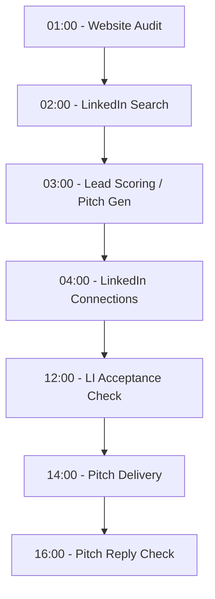

# AI-Powered B2B Lead Generator & Scraper

A robust web scraping and lead generation application built with FastAPI, SQLAlchemy, and Playwright. It extracts business information from Google Maps, performs deep website audits, calculates lead scores, and leverages AI (LLMs) to generate personalized sales pitches.

## Core Features

- **Google Maps Scraping**: Periodically scrapes businesses based on configured categories and locations.
- **Deep Website Auditing**: Analyzes scraped websites for SEO issues, broken links, mobile responsiveness, and speed metrics.
- **Smart Lead Scoring**: Automatically grades leads (A-F) based on their website health and identifies key pain points.
- **AI Sales Pitch Generation**: Dynamically generates personalized, high-converting outreach pitches using Multiple LLM providers (Gemini, Claude, OpenAI, Groq).
  - Evaluates whether the lead has a LinkedIn contact profile to decide between LinkedIn DM or Email formatting.
- **Automatic Pitch Delivery**: A scheduled background worker delivers generated pitches:
  - **Email**: Sent via SMTP (with delay throttles and retry state machine).
  - **LinkedIn DMs**: Sends DMs using a Playwright browser automation script, extracting direct compose URNs from connection profile cards to avoid name ambiguities.
- **Multi-Profile LinkedIn Architecture**: Run multiple LinkedIn accounts simultaneously! Session states and concurrency settings are managed directly in the MySQL database. 
  - Manage accounts via a full CRUD REST API.
  - Pin-point control over which scraping processes run on which profile (`allowed_processes`).
- **LinkedIn Connection Pipeline**: Orchestrates discovery, friend requesting, and checking acceptance to safely transition cold leads to connected outreach channels.
- **Quota & Cost Management**: Configurable rule-based pitch generation to skip LLM calls for low-priority/high-scoring leads.
- **Centralized Logging**: Clean daily rotating log files stored in `logs/` instead of stdout terminal noise.
- **Task Scheduling**: Integrated APScheduler for background job execution and batched orchestrations.

## Nightly Data & Delivery Pipeline

To ensure dependencies resolve correctly (e.g. knowing a contact exists before scoring a pitch, and ensuring connection status is synced before delivery), jobs run in the following chronological order:



1. **01:00 - Website Audit**: Runs checks on websites of scraped businesses.
2. **02:00 - LinkedIn Search**: Finds matching LinkedIn personal profiles for lead companies.
3. **03:00 - Lead Scoring & Pitch Generation**: Generates scores and personalizes pitches. Pitch format auto-targets LinkedIn if a profile was found, otherwise defaults to Email.
4. **04:00 - LinkedIn Connections**: Sends connection invites to found LinkedIn contacts.
5. **12:00 - LinkedIn Acceptance Check**: Syncs which pending requests were accepted (marks `is_connected=True`).
6. **14:00 - Pitch Delivery**: Delivers pending emails immediately, and LinkedIn DMs to newly-connected contacts. Unconnected pitches wait for the next cycle.
7. **16:00 - Pitch Reply Check**: Monitors LinkedIn DM threads to see if leads have responded to your pitch.


## Prerequisites

- Python 3.9+
- MySQL Server
- Playwright browsers (Chromium)

## Installation

1. **Clone the repository**:
   ```bash
   git clone https://gitlab.com/ankitscode/web-scrapping.git
   cd web-scrapping
   ```

2. **Create a virtual environment**:
   ```bash
   python -m venv venv
   source venv/bin/activate  # On Windows: venv\Scripts\activate
   ```

3. **Install dependencies**:
   ```bash
   pip install -r requirements.txt
   ```

4. **Install Playwright browsers**:
   ```bash
   playwright install chromium
   ```

## Configuration

### Environment Variables

Copy `.env.example` to `.env` and configure your database, scheduler, LLM API Keys, and other settings:

```bash
cp .env.example .env
```

Key environment configurations:
- **Database**: `DATABASE_URL` (MySQL).
- **Google Sheets Integration**: `GOOGLE_SHEET_ID`, `GOOGLE_SERVICE_ACCOUNT_EMAIL`.
- **AI / LLM Settings**:
  - `LLM_PROVIDER`: Select the AI model provider (`gemini`, `openai`, `claude`, `groq`).
  - `PITCH_LLM_MIN_GRADE`: Only generate AI pitches for leads at or below this grade (e.g., `C`).
- **Profile Concurrency**:
  - `MAX_CONCURRENT_PROFILES`: Control how many Playwright browsers can run at the same time to save memory.

### Scraper Settings
Modify `app/config/scraper_settings.json` to configure the schedule and target jobs:

```json
{
    "schedule_times": ["08:00", "15:00", "18:00"],
    "jobs": [
        { "category": "Gyms", "city": "New York", "state": "NY", "country": "United States" }
    ]
}
```

## Database Setup

1. **Create the database**:
   Ensure your MySQL server is running and create the database named in your `.env`.

2. **Run migrations**:
   ```bash
   alembic upgrade head
   ```

## Managing LinkedIn Profiles

You can add, edit, and configure your LinkedIn profiles directly through the API.
1. Authenticate your session using the Python save state script (it will dump the JSON state).
2. Create a new profile via the `POST /profile-settings/` API endpoint and paste the session JSON.
3. Configure `allowed_processes` to strictly limit what jobs this profile can execute (e.g., `["daily_linkedin_search", "daily_linkedin_connections"]`).

## Running the Application

Start the FastAPI development server:
```bash
fastapi dev main.py
```
*(Or use `uvicorn main:app --reload`)*

The scheduler will automatically start and run jobs at the configured times in the background.

## Running the Frontend

The project includes a TypeScript-based web user interface located in the `frontend` folder.

1. **Navigate to the frontend directory**:
   ```bash
   cd frontend
   ```

2. **Install frontend dependencies**:
   ```bash
   npm install
   ```

3. **Start the development server**:
   ```bash
   npm run dev
   ```

4. **Build for production** (optional):
   ```bash
   npm run build
   ```

## API Documentation

- **Swagger UI**: [http://127.0.0.1:8000/docs](http://127.0.0.1:8000/docs)
- **Redoc**: [http://127.0.0.1:8000/redoc](http://127.0.0.1:8000/redoc)

## Project Structure

- `app/`: Main application logic.
  - `config/`: Database and scraper settings.
  - `core/`: Scheduler, LLM provider factory, Prompts, and base utilities.
  - `models/`: SQLAlchemy database models (including `ProfileSetting`).
  - `router/`: FastAPI API endpoints (Audits, Leads, Webhooks, Profile Settings).
  - `services/`: Business logic, lead scoring, and LLM pitch orchestration.
  - `scraper/`: Low-level scraping implementation using Playwright (Google Maps, LinkedIn, Website Crawler).
  - `utils/`: Loggers, API formatters.
- `alembic/`: Database migration scripts and configuration.
- `logs/`: Application generated daily log files.
- `main.py`: Application entry point.
