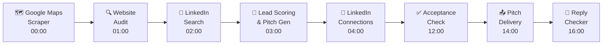
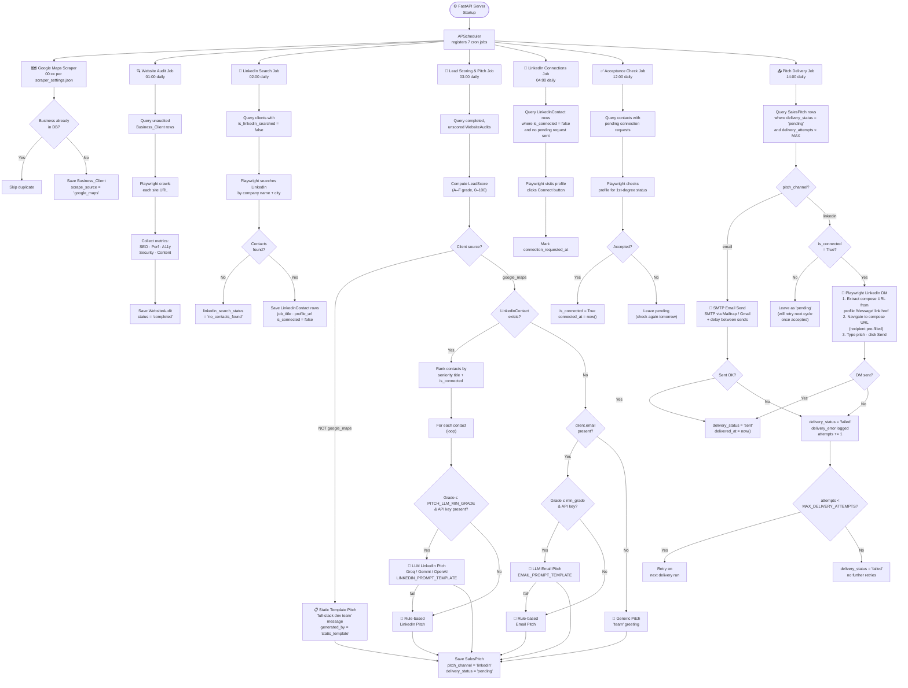
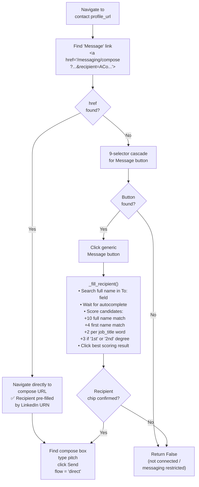
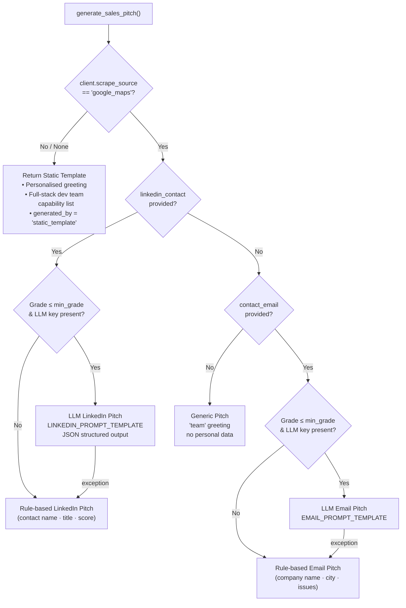
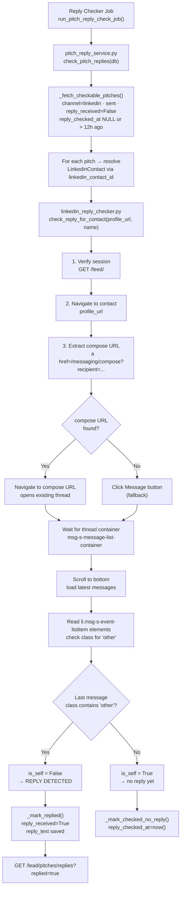

# AI-Powered B2B Lead Generation — Full System Workflow

## High-Level Nightly Pipeline

---

## Detailed Component Workflow

---

## LinkedIn DM Sending Strategy

---

## Pitch Generation Decision Tree

---

## Reply Checker Strategy

